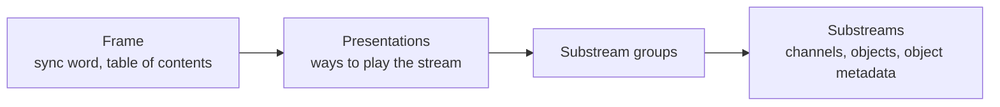

# AC-4

This page covers **AC-4** as ICL Forge implements it. It assumes the [AC-3 & E-AC-3](ac3-eac3.md)
page for the ideas both formats share: frames, transforms, channel beds and the LFE.

## A different codec

AC-4 is defined by ETSI TS 103 190: Part 1 for channel-based coding and Part 2 for immersive and
personalized audio. It shares no bitstream syntax with AC-3 or E-AC-3, so it does not build on
them the way E-AC-3 builds on AC-3. A decoder for AC-3 and E-AC-3 cannot read an AC-4 stream, and
an AC-4 stream carries no AC-3 or E-AC-3 stream inside it for such a decoder to fall back to.

ICL Forge's AC-4 library, `iclforge::ac4`, was written from the two parts and
link nothing from `iclforge::ac3`. [AC-4 decoding and encoding](../library/ac4.md) is their API
reference.

## Frames and the table of contents

A raw AC-4 stream is a run of sync frames. Each starts with a sync word, `0xAC40`, or `0xAC41`
when a CRC word follows the frame, and a frame size.

A frame lasts one video frame at any of 13 frame rates, from 23.976 to 120 fps, or it is 2,048
samples at the sample rate (frame rate index 13: 42.7 ms at 48 kHz). AC-3 frames are always 1,536
samples. Except at index 13, the codec works at an internal sample rate, and a sample rate
converter produces the 48 kHz output.

Every frame opens with a **table of contents** (TOC). It lists the frame's presentations and
substream groups, and where each substream sits in the frame. Only some frames, the **I-frames**,
carry the configuration that A-SPX and A-CPL (below) need. A decoder that starts part-way through
a stream therefore puts out nothing until the next I-frame, except for a stream in the SIMPLE
mode, which decodes one frame after its start. A `sequence_counter` of 0 marks a splice.

## Presentations and substreams

A **presentation** is one way of playing some of the stream's substreams together: music and
effects with English dialogue, the same with German dialogue, the main audio with audio
description. A stream can carry several. The decoder plays one, chosen by its `presentation_id`,
by its place in the table of contents, or else by preferences: the listener's language, the kind
of associated audio wanted (audio description, say) and whether the presentation was rendered for
headphones. It mixes the presentation's substreams, with a gain for the dialogue against the music
and effects and one for the associated audio. Each presentation states the least decoder level
(`md_compat`) it needs, and this decoder claims level 7, "unrestricted", unless it is told a lower one.

A **substream** is one coded piece of a presentation:

- **Channels.** One channel element for a layout: mono, stereo, 3.0, 5.X, 7.X or the immersive
  element. The X is the optional LFE. The immersive element carries a layout with height
  channels, as 7.X.4; 5.1.4 is coded as 7.X.4 with the back pair absent.
- **Objects.** [Objects](atmos-joc.md#channels-vs-objects) are coded in one of two ways. In an
  **A-JOC** substream (advanced joint object coding) a downmix is coded with the matrices that
  rebuild the objects from it, as JOC does inside E-AC-3 but in AC-4's own syntax. **Direct-coded**
  object substreams code each object's audio, beside an **OAMD** substream (object audio
  metadata) that carries the group's positions, gains and sizes over time.

## Coding tools

A channel element is coded in one of a few modes, each adding tools to the ones before it:

- **SIMPLE** codes the spectrum as waveform alone, through the MDCT.
- **ASPX** adds **A-SPX** (advanced spectral extension), which codes the waveform up to a
  crossover frequency and rebuilds the band above it from the band below, adjusted by coded
  envelopes, noise and tones. Companding is used in the A-SPX modes at low rates.
- **ASPX_ACPL_1, 2 and 3** add **A-CPL** (advanced coupling), which codes fewer channels, a
  downmix, and rebuilds the others from per-band level differences and correlation and from
  decorrelators.
- The immersive element has five modes of its own: SCPL and ASPX_SCPL (eleven waveform-coded
  tracks and a fixed matrix, without and with A-SPX), ASPX_ACPL_1 and ASPX_ACPL_2 (seven tracks and
  A-CPL), and ASPX_AJCC (five tracks and **A-JCC**, advanced joint channel coding).

Part 2 lets a decoder support **full decoding**, in which A-CPL, A-JCC and A-JOC reconstruct every
channel and object, or **core decoding**, which skips or simplifies them for low-complexity
playback: an A-JOC substream then decodes to its downmix. The decoder here does both.

Rendering objects to loudspeakers is not part of the standard. The decoder hands each object's
audio and properties (position, gain, size, zone constraints, divergence, snap, timing) to a
renderer, and ICL Forge renders them with the layout renderer Hearth uses for E-AC-3's objects.

Dolby's tools also write an **immersive stereo** (IMS) mode. Neither part of the standard uses
the term. Its streams are one stereo A-SPX substream, with a presentation version that Part 2
gives no syntax, and this decoder reads them as stereo. The `b_pre_virtualized` flag marks a
presentation that was rendered for headphones before it was encoded; the decoder uses it only to
choose between presentations.

## Loudness, dynamic range and downmix

- **Dialogue level.** A stream's dialnorm runs from 0 to -31.75 dBFS in quarter-dB steps. The
  system chooses an output level, and the gain that takes the dialogue there is
  2^((output level - dialnorm) / 6), which can boost as well as cut.
- **Dynamic range.** There are no line or RF modes and no cut or boost scale factors. A stream
  carries up to eight DRC decoder modes, four of which have a meaning: home theatre (for output
  levels of -31 to -27 dBFS), flat panel TV (-26 to -17), and portable speakers and portable
  headphones (both -16 to 0). The output level selects one unless the listener names it.
- **Dialogue enhancement.** Raises the dialogue against the rest of the mix, by up to a cap the
  stream sets, 3, 6, 9 or 12 dB.
- **Downmix.** Lo/Ro and Lt/Rt are built from the stream's own mixing gains, and the stream can
  name the method it prefers.

## What the library covers

| | Decoder | Encoder |
|---|---|---|
| Channels | Mono, stereo, 3.0, 5.X and 7.X in SIMPLE, ASPX and the A-CPL modes, at every frame rate; the immersive element (7.X.4, which is how 5.1.4 is coded) in full and core decoding | Mono, stereo, 5.0 and 5.1 in SIMPLE, ASPX and the A-CPL modes, at 48 kHz at every frame rate or 44.1 kHz in 2,048-sample frames; 5.0.4 and 5.1.4 in the immersive element |
| Objects | A-JOC in full and core decoding, and direct-coded objects, with each object's metadata | A-JOC and direct-coded objects, at frame rate index 13 alone, 64 objects at most with one LFE |
| Presentations | Several, chosen and mixed as above | Several substreams, and the presentations made of them |
| Not decoded, not written | Not decoded: 22.2 in core decoding or to any layout but as coded (Part 2 gives it neither), presentations spread over several elementary streams, and, at 96 or 192 kHz, everything but the SIMPLE codec mode (the SIMPLE mode decodes there with the output level and the downmix, from the text alone) | Not written: the speech spectral frontend, immersive stereo, 22.2 and 9.X.4, the efficient high frame rate mode, presentations spread over several elementary streams, and 96 or 192 kHz coding (such input is converted to 48 kHz first). 7.X, 3.0, ASPX_ACPL_1 and the 7.X.4 layouts are written only behind experimental options |

No second decoder decodes the object streams this encoder writes: librempeg refuses object
coding, and Dolby's encoder writes none to compare against. They are checked against ICL Forge's
own decoder. The standard has no conformance streams and no reference decoder, so
[Validation: AC-4](../verification.md#ac-4) describes how decoded output is checked: against
streams from Dolby's encoder, against a second transcription of the syntax, and against each
control's formula.

A stream can be a raw `.ac4` file, or sit in MP4 (with its `dac4` box), MPEG-TS, or fragmented MP4
for HLS and DASH. Matroska has no AC-4 codec ID registered, so `forge mkv` refuses it. AC-4 can be
carried in IEC 61937-14 bursts for S/PDIF and HDMI, which `forge spdif` writes and Hearth sends to
network sinks that list it; no receiver found so far accepts it, so playback decodes it.

The [object signing](object-signing.md) tag is an E-AC-3 feature. The AC-4 encoder writes its
EMDF containers with no protection bytes, and the decoder needs no key.

!!! example "See it in code"
    - [AC-4 decoding and encoding](../library/ac4.md)
    - [CLI commands](../forge/cli/commands.md): `ac4-encode`, and `probe`, `decode` and the other
      commands that read AC-4
    - [Hearth](../hearth/index.md#ac-4): the desktop player's AC-4 controls

---

Back to the [Concepts overview](index.md), or on to [AC-3 & E-AC-3](ac3-eac3.md).
