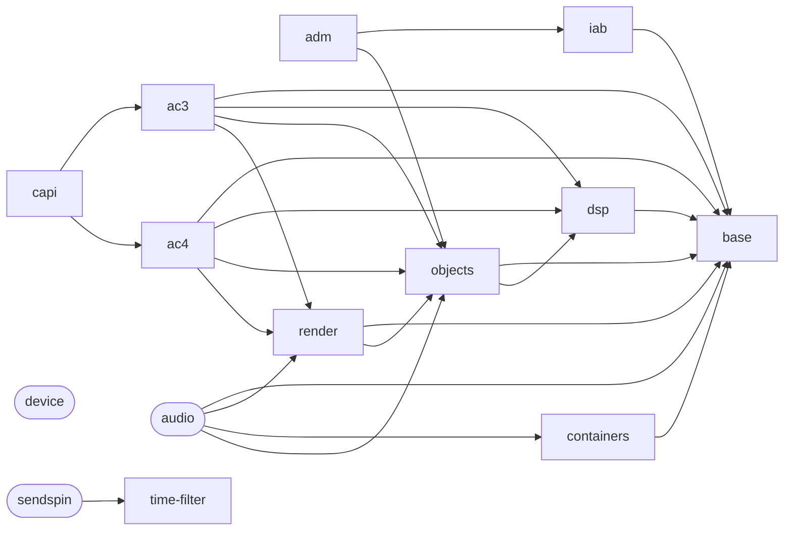

<!-- generated by tools/checks/generate_project_pages.py from tools/checks/projects.json; do not edit -->

# The projects of the tree

The repository is a monorepo of projects: libraries under `libs/`, the programs of each product
under `apps/`, the code several programs compile in under `apps/shared/`, the language bindings
under `bindings/`, the firmware under `firmware/`, and the examples and cross-project tests. Every
one is a row of [`tools/checks/projects.json`](https://github.com/iainchesworthlabs/iclforge/blob/main/tools/checks/projects.json), which says what it may use;
`check_layering.py` holds every `#include` and every CMake link line of the tree to it, and the CI
planners read the same rows to decide what a change builds ([CI lane partitions](ci-lanes.md)).
This page is generated from it.

A library uses only libraries. A program, a binding, a firmware project and an example use
libraries (a program also the shared code) and never another program, and no library uses a
program. An *internal* project is never installed, and no installed header includes one. A header
another project includes is under the project's `include/` or a directory its row exposes. Each
project's tests are beside it, and `ctest -L <project>` runs them.

## Libraries

| Project | Path | What it is | Uses | Used by | CI lanes |
|---|---|---|---|---|---|
| `ac3` | `libs/ac3/` | The AC-3 and E-AC-3 codec, including Joint Object Coding (Atmos objects) and EMDF object signing, with loudness metering, level analysis and quality measurement. | `base`, `dsp`, `objects`, `render` | `app-media`, `baremetal`, `capi`, `crucible`, `demo-android`, `demo-wasm`, `esp-idf`, `esphome`, `examples`, `forge`, `hearth`, `hearth-sink`, `python`, `tests` | core |
| `ac4` | `libs/ac4/` | The AC-4 decoder and encoder, with the sync frames, table of contents and presentations both work through. | `base`, `dsp`, `objects`, `render` | `app-media`, `baremetal`, `capi`, `crucible`, `demo-wasm`, `esp-idf`, `examples`, `forge`, `hearth`, `python`, `tests` | core |
| `adm` | `libs/adm/` | ADM and BW64 reading and writing, and the mapping between ADM objects and the Atmos encoder and decoder. | `iab`, `objects` | `examples`, `forge` | core |
| `audio` (internal) | `libs/audio/` | Live capture, IEC 61937 passthrough delivery, shared-mode monitor playback and the OSC object-position source: the OS-specific audio code of the project. Internal; never installed. | `base`, `render`, `containers`, `objects` | `crucible`, `demo-android`, `forge`, `hearth` | core |
| `base` | `libs/base/` | What every codec and service builds on and none owns: the bit reader and writer, the speaker vocabulary, the level and loudness meters, WAV reading and writing, the CPU probe, the signing key with SHA-256 and HMAC-SHA-256, the scalar building blocks of the arithmetic tiers and the build version. | nothing | `ac3`, `ac4`, `audio`, `baremetal`, `containers`, `crucible`, `demo-android`, `dsp`, `esp-idf`, `examples`, `forge`, `hearth`, `iab`, `objects`, `python`, `render` | core |
| `capi` | `libs/capi/` | The C API over the AC-3 and AC-4 libraries: plain C11, opaque handles and POD structs, for bindings and callers that cannot link C++23. | `ac3`, `ac4` | `examples`, `rust` | core |
| `containers` | `libs/containers/` | The codec-blind carriage: IEC 61937 burst packing and detection, the Matroska, MP4 and MPEG-TS writers and readers, and IAMF reading and writing. | `base` | `app-media`, `audio`, `crucible`, `demo-android`, `examples`, `forge`, `hearth`, `python` | core |
| `device` (internal) | `libs/device/` | The device-side logic of the ESP32 sinks and players that needs no SDK, so that the host tests it: the interleave and the slot conversion, the playout and DAC queue models, the sink planner, the Improv provisioning protocol, the pairing records and the firmware image rules. Header-only. Internal; never installed. | nothing | `esp-idf`, `hearth`, `hearth-sink` | core |
| `dsp` | `libs/dsp/` | The signal processing more than one library uses: the FFT, the QMF bank, the offline sample-rate converter and filter sections, and the tiered (float and fixed-point) kernels AC-4 builds at its decode tier. | `base` | `ac3`, `ac4`, `baremetal`, `esp-idf`, `forge`, `objects`, `tests` | core |
| `iab` | `libs/iab/` | SMPTE ST 2098-2 Immersive Audio Bitstream reading and writing, as bare bitstreams and in MXF. | `base` | `adm`, `examples`, `forge` | core |
| `objects` | `libs/objects/` | The object-audio model: an object's position and path over time, the placement an encoder is handed each frame, and the Object Audio Metadata payload of ETSI TS 103 420 with the EMDF container it travels in. | `base`, `dsp` | `ac3`, `ac4`, `adm`, `app-media`, `audio`, `baremetal`, `crucible`, `demo-wasm`, `esp-idf`, `examples`, `forge`, `hearth`, `python`, `render` | core |
| `render` | `libs/render/` | From what a decoder produced to what the speakers want: layouts and their text form, routing, per-output trim and delay, the bed and object renderer and the panning under it. | `base`, `objects` | `ac3`, `ac4`, `app-media`, `audio`, `baremetal`, `esp-idf`, `examples`, `forge`, `hearth`, `hearth-sink` | core |
| `sendspin` (internal) | `libs/sendspin/` | The Sendspin protocol: the server half Hearth's engine uses and the player half its test sink and the ESP32 sinks use. Internal; never installed. | `time-filter` | `esp-idf`, `hearth`, `hearth-sink` | core |

## Vendored code

| Project | Path | What it is | Uses | Used by | CI lanes |
|---|---|---|---|---|---|
| `time-filter` | `external/time-filter/` | The vendored clock-synchronisation filter that Sendspin keeps its players in time with. | nothing | `sendspin` | core |

## Shared code of the programs

| Project | Path | What it is | Uses | Used by | CI lanes |
|---|---|---|---|---|---|
| `app-media` (internal) | `apps/shared/media/` | The media code the programs compile in: container input, stream playback, recording sinks, the AC-4 object renderer. Internal; compiled into Forge, Hearth and Crucible. | `ac3`, `ac4`, `containers`, `objects`, `render` | `forge`, `hearth` | windows, linux, macos |
| `app-preferences` (internal) | `apps/shared/preferences/` | The settings store and its migration, shared by the desktop programs. Internal; compiled into the programs. | nothing | `crucible`, `forge`, `hearth` | windows, linux, macos |
| `app-theme` (internal) | `apps/shared/theme/` | The theme and system-theme detection the desktop programs share. Internal; compiled into the programs. | nothing | `crucible`, `forge`, `hearth` | windows, linux, macos |

## Programs

| Project | Path | What it is | Uses | Used by | CI lanes |
|---|---|---|---|---|---|
| `crucible` | `apps/crucible/` | Crucible: the Atmos monitoring bed and its virtual output device, for Windows, Linux and macOS. | `ac3`, `ac4`, `audio`, `base`, `containers`, `objects`, `app-preferences`, `app-theme` | nothing | windows, linux, macos |
| `demo-android` | `apps/demos/android/` | The Android (Shield) demo application. | `ac3`, `audio`, `base`, `containers` | nothing | android |
| `demo-wasm` | `apps/demos/wasm/` | The browser demos, built with Emscripten. | `ac3`, `ac4`, `objects` | nothing | wasm |
| `forge` | `apps/forge/` | Forge: the command-line tool (forge) and the desktop application (forge-gui) for encoding, decoding, analysis and QC of AC-3, E-AC-3 and AC-4. | `ac3`, `ac4`, `adm`, `audio`, `base`, `containers`, `dsp`, `iab`, `objects`, `render`, `app-media`, `app-preferences`, `app-theme` | nothing | windows, linux, macos |
| `hearth` | `apps/hearth/` | Hearth: the reference player: its engine (the queue, the transport, the output decision), the Qt application, and the test sink and test server. | `ac3`, `ac4`, `audio`, `base`, `containers`, `device`, `objects`, `render`, `sendspin`, `app-media`, `app-preferences`, `app-theme` | nothing | windows, linux, macos |

## Bindings

| Project | Path | What it is | Uses | Used by | CI lanes |
|---|---|---|---|---|---|
| `js` | `bindings/js/` | The npm package over the WebAssembly build. | nothing | nothing | wasm, npm |
| `python` | `bindings/python/` | The Python binding: the iclforge wheel, built with scikit-build-core. | `ac3`, `ac4`, `base`, `containers`, `objects` | nothing | python |
| `rust` | `bindings/rust/` | The Rust crates: iclforge and iclforge-sys over the C API. | `capi` | nothing | rust |

## Firmware

| Project | Path | What it is | Uses | Used by | CI lanes |
|---|---|---|---|---|---|
| `baremetal` | `firmware/baremetal/` | The minimum-footprint probes: the Cortex-M3 build under QEMU, the ESP32 images and the fixtures they decode. | `ac3`, `ac4`, `base`, `dsp`, `objects`, `render` | nothing | esp |
| `esp-idf` | `firmware/esp-idf/` | The ESP-IDF component: the codec and player for the ESP32-S3, C3, C6 and P4, with its examples. | `ac3`, `ac4`, `base`, `device`, `dsp`, `objects`, `render`, `sendspin` | nothing | esp |
| `esphome` | `firmware/esphome/` | The ESPHome external component that brings the ESP-IDF component into an ESPHome build. | `ac3` | nothing | esp |
| `hearth-sink` | `firmware/hearth-sink/` | Hearth's sink firmware for the ESP32 boards, a Sendspin player built on the ESP-IDF component. | `ac3`, `device`, `render`, `sendspin` | nothing | esp |

## Examples

| Project | Path | What it is | Uses | Used by | CI lanes |
|---|---|---|---|---|---|
| `examples` | `examples/` | The library's example programs, in C++ and Python. | `ac3`, `ac4`, `adm`, `base`, `capi`, `containers`, `iab`, `objects`, `render` | nothing | core |

## Tests

| Project | Path | What it is | Uses | Used by | CI lanes |
|---|---|---|---|---|---|
| `tests` | `tests/` | What every test binary is built with (iclforge::test_support) and the performance tests. | `ac3`, `ac4`, `dsp` | nothing | core |

## The libraries

An arrow is *uses*; a rounded box is an internal library.

## What the table allows by name

Uses the kinds forbid and the tree has on purpose, each with its reason. One that
excuses nothing fails the check.

| From | To | Where | Why |
|---|---|---|---|
| `ac4` | `app-media` | `libs/ac4/tests/decoder/test_object_render.cpp` | The one test of the object renderer builds its streams with the AC-4 tests' own helper (decoder/objects.hpp, which includes the encoder's private headers), so it stays in libs/ac4/tests and compiles apps/shared/media/src/ac4_object_render.cpp into ac4's test binary: a library's test using an app-library (planning/monorepo.md, C7-2, finding 4). |
| `hearth-sink` | `esp-idf` | any file | The sink is Hearth's firmware and the component is its dependency (main/idf_component.yml, override_path): the player, the control surface and the sinks' common code are the component's. A firmware project using another. |
| `esp-idf` | `baremetal` | `firmware/esp-idf/iclforge/examples/i2s_player/` | The i2s_player example decodes the 5.1 fixture the bare-metal probe carries (fixture.hpp) rather than a copy of it: one firmware project using another's file. |

